# Barta App

  
   
   
  

  <b>Safe messaging for tweens. Peace of mind for parents.</b>
   
  Barta is a secure web-based messaging platform designed specifically for tweens (ages 8-12) to communicate safely under parental supervision. It provides a controlled environment with robust moderation tools, ensuring digital safety while fostering independence.

---

## 🔗 Live Site
**[https://barta.infinityfreeapp.com/](https://barta.infinityfreeapp.com/)**

---

## 📋 Table of Contents
- [Project Details](#-project-details)
- [Features](#-features)
- [Screenshots](#-screenshots)

---

## 🎓 Project Details

*   **Project Group:** Group 1
*   **Course:** CSE311L (Section 7)
*   **Semester:** Fall 2025 (North South University)
*   **Lab Instructor:** Rubyda Hossain
*   **Faculty:** Dr. Nabil Bin Hannan (NlH)

### 👥 Group Members

| Name | NSU ID | Email |
| :--- | :--- | :--- |
| **Aminul Islam** | 2321169042 | <aminul.islam.232@northsouth.edu> |
| **Naylah Hassan Chowdhury** | 2311531042 | <naylah.chowdhury@northsouth.edu> |
| **Maymuna Khanom** | 2232039642 | <maymuna.khanom@northsouth.edu> |

---

## 🚀 Features

Barta divides features into two distinct interfaces to ensure safety and control.

### 🐣 Tween Panel (for Children)
*   **Secure Messaging:** Real-time chat interface restricted to parent-approved friends only.
*   **Friend Discovery:** Search for friends and send connection requests (subject to parent approval).
*   **Personalized Experience:**
    *   Rich, responsive UI with Dark/Light mode toggle.
    *   Manage profile bio.
*   **Healthy Habits:** Visual indicators for daily message limits.
*   **Safety Feedback:** Immediate notifications if a sent message contains blocked words and requires approval.

### 🛡️ Parent Panel (for Guardians)
*   **Centralized Dashboard:** Monitor multiple children from a single view, including activity stats (messages sent/received).
*   **Complete Oversight:**
    *   **Friend Management:** Review, approve, or decline friend requests. Block or remove existing friends.
    *   **Message Moderation:** Review flagged messages containing blocked words. Approve legitimate messages or reject inappropriate ones.
    *   **Blocked Words System:** Add or remove specific words from the blocklist for each child.
*   **Usage Controls:** Set custom daily message limits for each child to manage screen time.
*   **Reporting:** Print functionality to generate hard copies of the dashboard activity.

---

## 📸 Screenshots

Key screenshots of application interfaces, safety features, and parental moderation dashboard:

### 🔐 Authentication & Onboarding

| Tween Login | Parent Login |
| :---: | :---: |
| 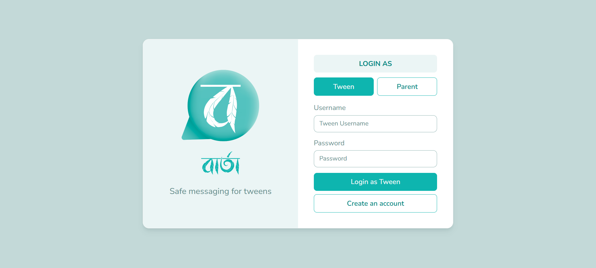 | 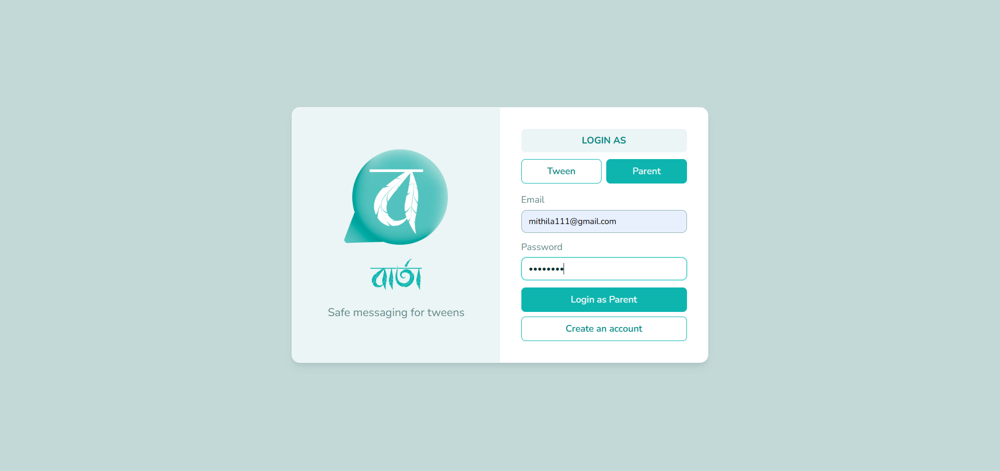 |
| **Tween Registration** | **Parent Registration** |
| 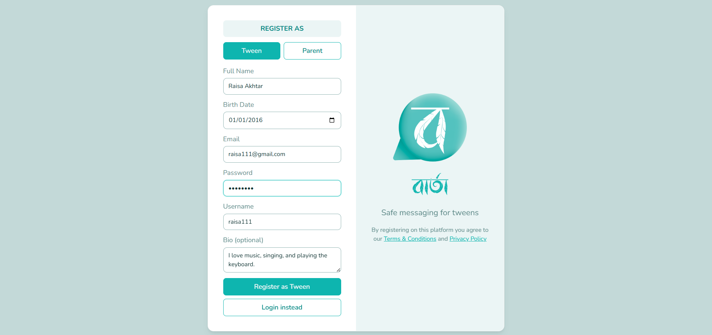 | 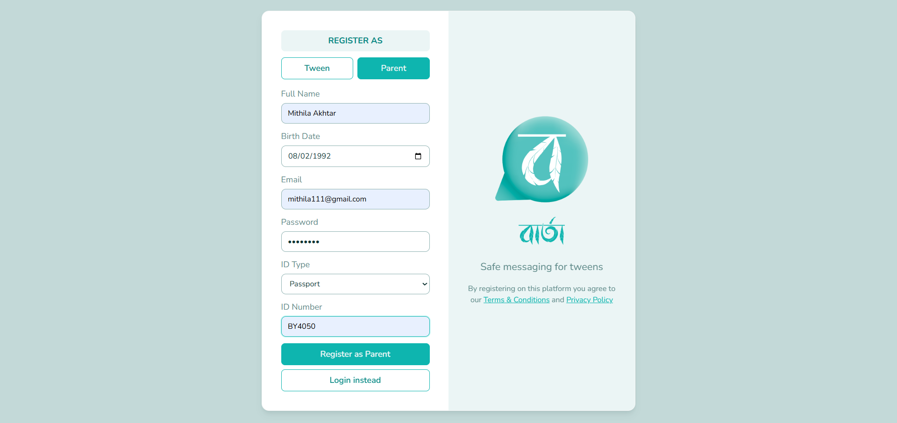 |

| Tween Account Linking (Parent Verification Request) |
| :---: |
| 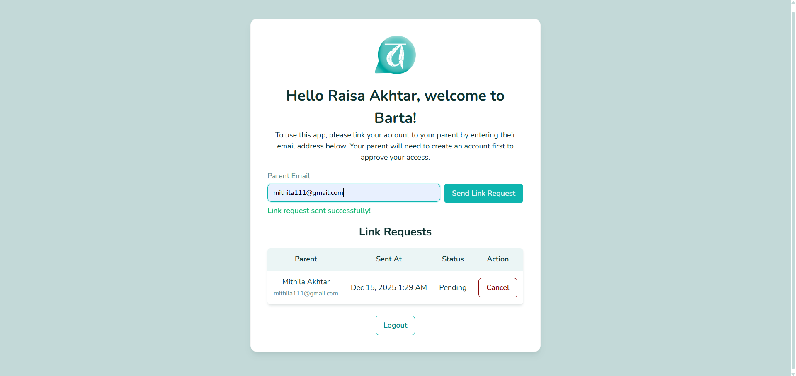 |

### 🐣 Tween Panel (Child Interface)

| Chat Interface (Light Mode) | Chat Interface (Dark Mode & Moderation Notice) |
| :---: | :---: |
| 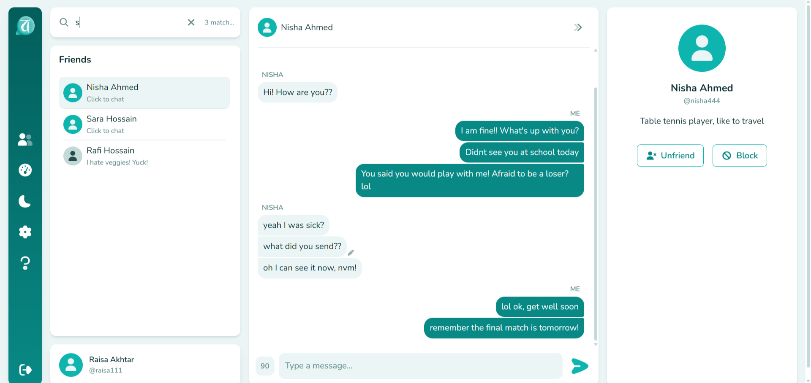 | 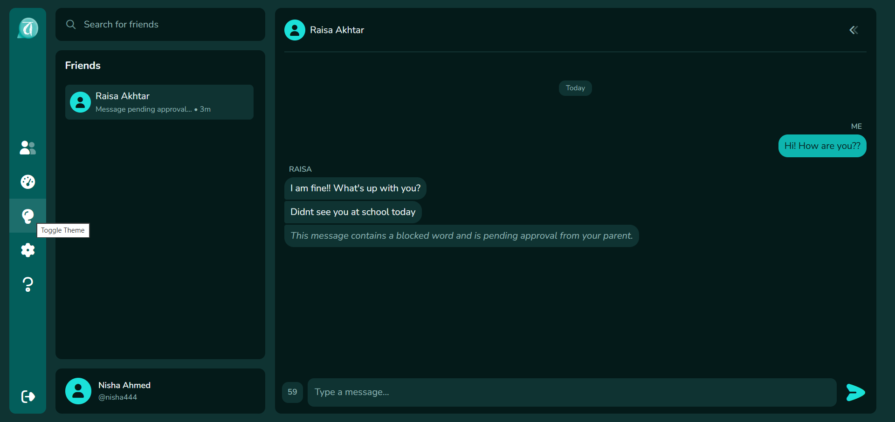 |
| **Daily Message Limit Tracker** | **Message Moderation Feedback (Rejected)** |
| 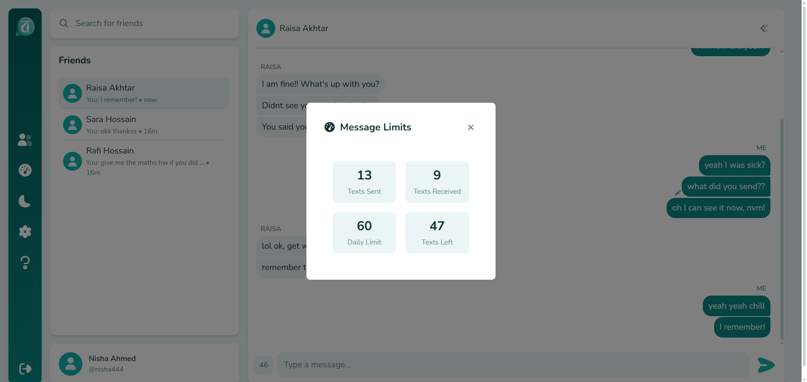 | 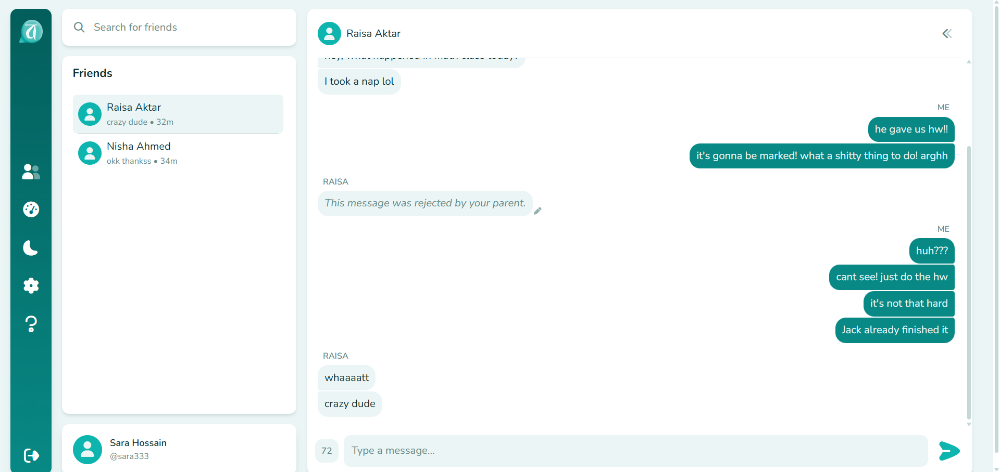 |

| Help & Safety Guidance |
| :---: |
| 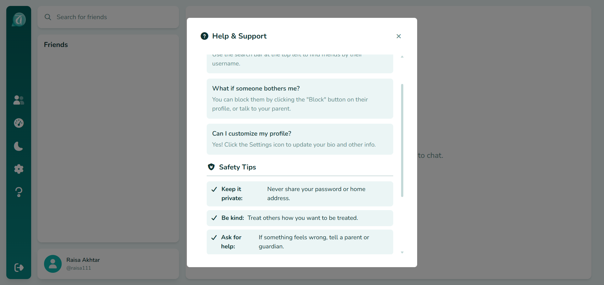 |

### 🛡️ Parent Panel (Guardian Supervision & Dashboard)

| Pending Tween Link Requests | Pending Friend Requests Approval |
| :---: | :---: |
| 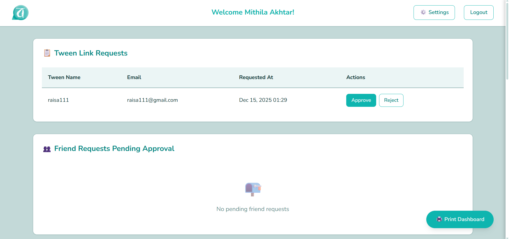 | 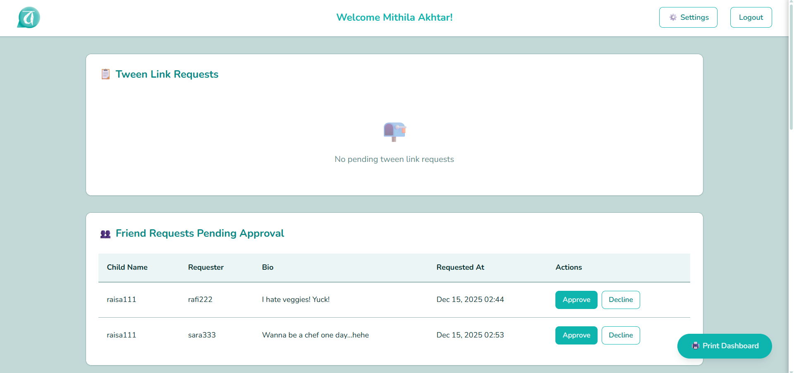 |
| **Flagged Messages & Linked Children Overview** | **Friend Management & Blocked Words List** |
| 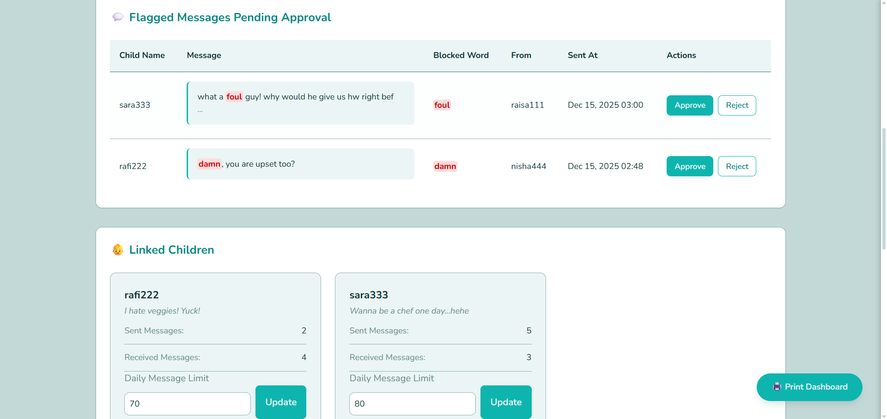 | 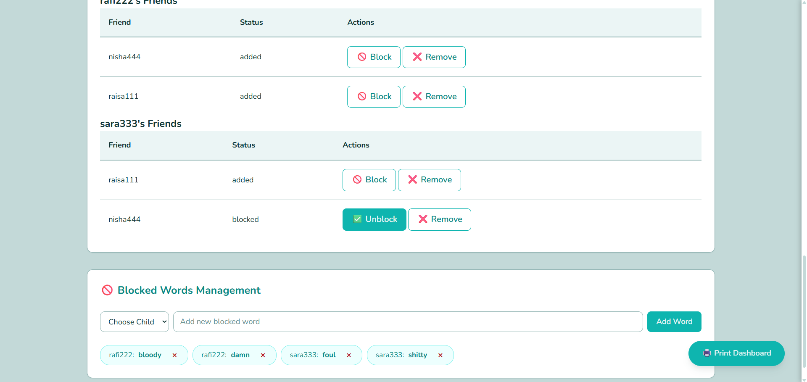 |

| Parent Profile & Security Settings |
| :---: |
| 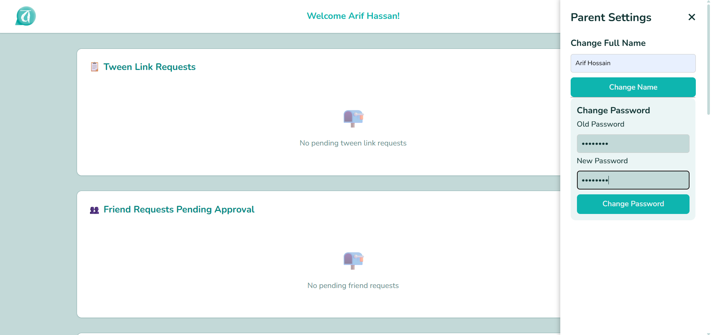 |

